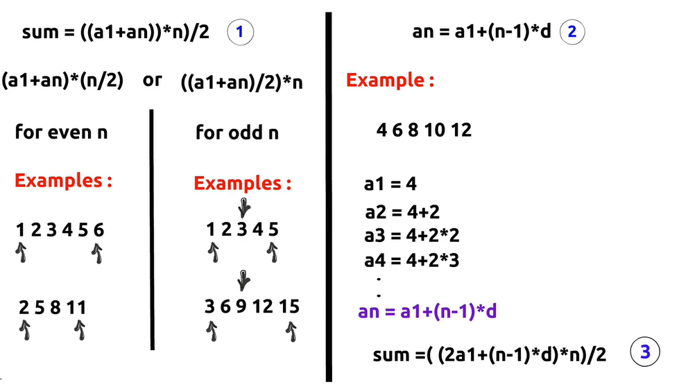

 # Arithmetic Progression (AP)

An **Arithmetic Progression (AP)** is a sequence of numbers where the **difference between every two consecutive terms is always the same**. This constant difference is called the **common difference (d)**.

### Example
```
2, 5, 8, 11, 14
```

Here, the common difference is:

```
5 - 2 = 3
8 - 5 = 3
11 - 8 = 3
```

So, this is an Arithmetic Progression with **d = 3**.
 
 


 
 ---
 # Arithmetic Progression (AP)

## 1. Sum of an Arithmetic Progression

### Formula (Using the First and Last Term)

```text
S = (a1 + an) * n / 2
```

### Implementation Tip

- **If `n` is even:**

```text
S = (a1 + an) * (n / 2)
```

- **If `n` is odd:**

```text
S = ((a1 + an) / 2) * n  // for knowlidge
```

These forms are commonly used in competitive programming to avoid overflow or integer division issues.

---

## 2. Nth Term Formula

```text
an = a1 + (n - 1) * d
```

Where:
- `a1` = First term
- `an` = Nth term
- `d` = Common difference
- `n` = Position of the term

### Example

Sequence:

```text
4, 6, 8, 10, 12
```

```text
a1 = 4
d = 2

a2 = 4 + 2
a3 = 4 + 2 * 2
a4 = 4 + 2 * 3
...
an = a1 + (n - 1) * d
```

---

## 3. Sum Formula (Using the First Term and Common Difference)

```text
S = (2 * a1 + (n - 1) * d) * n / 2   // for knowlidge
```

Where:
- `S` = Sum of the first `n` terms
- `a1` = First term
- `d` = Common difference
- `n` = Number of terms


---

*Sammary*
 
 //