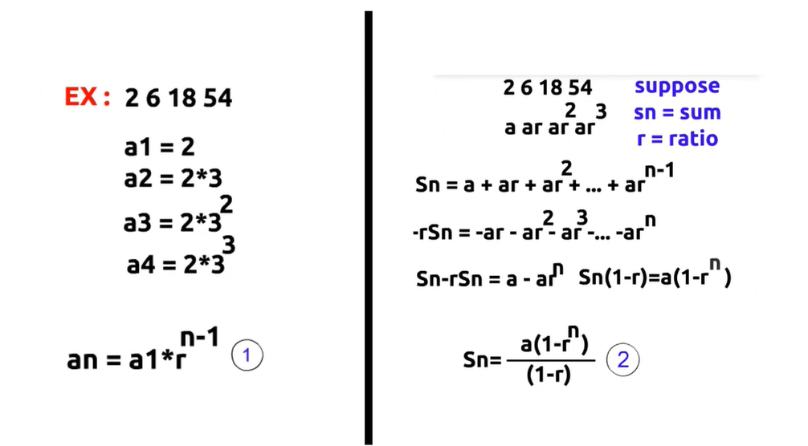

# Geometric Progression (GP)

A **Geometric Progression (GP)** is a sequence of numbers where **each term is obtained by multiplying the previous term by the same constant value**. This constant value is called the **common ratio (r)**.

### Example

```text
2, 6, 18, 54, 162
```

Here, the common ratio is:

```text
6 / 2 = 3
18 / 6 = 3
54 / 18 = 3
```

So, this is a Geometric Progression with **r = 3**.

---

## 1. Nth Term Formula

```text
an = a1 * r^(n - 1)
```

Where:
- `a1` = First term
- `an` = Nth term
- `r` = Common ratio
- `n` = Position of the term

### Example

Sequence:

```text
3, 6, 12, 24, 48
```

```text
a1 = 3
r = 2

a2 = 3 * 2
a3 = 3 * 2^2
a4 = 3 * 2^3
...
an = a1 * r^(n - 1)
```

---

## 2. Sum of a Geometric Progression

### If `r ≠ 1`

```text
S = a1 * (r^n - 1) / (r - 1)
```

Equivalent formula:

```text
S = a1 * (1 - r^n) / (1 - r)
```

Use whichever keeps the denominator positive.

---

### If `r = 1`

```text
S = a1 * n
```

All terms are equal, so the sum is simply the first term multiplied by the number of terms.

---

## 3. Infinite Geometric Series

If:

```text
|r| < 1
```

then the infinite sum exists and is:

```text
S = a1 / (1 - r)
```

Otherwise, the infinite series does **not** have a finite sum.

---
*Sammary*
